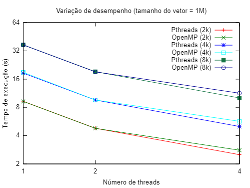
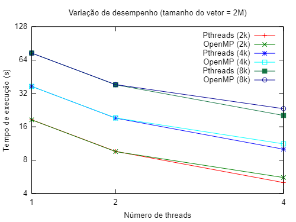

[Programação Paralela](https://github.com/lucasroges/elc139-2019a) > T2

Programação Paralela Multithread
--------------------------------

- Nome: Lucas Roges de Araujo
- Disciplina: Programação Paralela
--------------------------------

- Especificações da arquitetura utilizada em [specs.txt](https://github.com/lucasroges/elc139-2019a/blob/master/trabalhos/t2/specs.txt).

- Topologia da arquitetura utilizada em [lstopo.png](lstopo.png).

- Casos testados e resultados obtidos em [results.csv](https://github.com/lucasroges/elc139-2019a/blob/master/trabalhos/t2/results.csv).

- Gráficos comparativos de desempenho no [fim da página](https://github.com/lucasroges/elc139-2019a/blob/master/trabalhos/t2/Entrega.md#desempenho-comparativo).

## Parte 1: Pthreads

1. Particionamento: o particionamento do problema (cálculos) ocorre dentro da função executada por cada thread. A variável de argumento passada para a função funciona como um id para cada thread e a partir desse id é calculado o index inicial e final do vetor para realizar as multiplicações e a soma dos resultados dentro desse intervalo. Na divisão realizada, cada thread fica responsável por um intervalo de tamanho ```wsize```.
   ```
   long offset = (long) arg; // "id" de cada uma das threads
   int start = offset * wsize; // cálculo do index inicial para a thread
   int end = start + wsize; // cálculo do index final para a thread
   ```

   Comunicação: não há comunicação entre as threads enquanto elas efetuam as multiplicações, elas apenas somam o valor encontrado, por cada uma delas, na variável global. O trecho de código abaixo mostra o momento em que as threads incrementam o valor da soma encontrada no valor total. A operação que ocorre em [pthreads_dotprod.c](https://github.com/lucasroges/elc139-2019a/blob/master/trabalhos/t2/pthreads_dotprod/pthreads_dotprod.c) utiliza mutex para garantir exclusividade a cada thread no momento de acessar e incrementar a variável que guarda a soma total.
   ```
   pthread_mutex_lock (&mutexsum);
   dotdata.c += mysum;
   pthread_mutex_unlock (&mutexsum);
   ```

   Aglomeração: a aglomeração utilizada no código consiste em dividir o processamento em grandes blocos dos vetores, para cada thread, e comunicar a variável comum, e global, a todas as threads somente no final do processamento. Essa forma de resolver o problema é bem mais efetiva do que, por exemplo, resolver cada multiplicação e atualizar diretamente na variável global, pois a grande quantidade de acessos a essa variável (comunicação) exigiria constante sincronização, afetando o tempo total de execução.

   Mapeamento: não há um mapeamento específico para os processadores, mas há um balanceamento de carga estático onde cada thread fica responsável por ```1/nthreads``` ou ```wsize``` das multiplicações, levando em consideração o tamanho total dos arrays.

2. O speedup de 1 para 2 threads foi de 1.93, enquanto o speedup de 1 para 4 threads foi de 3.69 (o speedup de 2 para 4 threads foi de 1.91).

3. O speedup para os casos do Pthreads se mantém bem semelhantes para 2 threads e com pequenas alterações para 4 threads. A variação realizada contemplou 3 tamanhos de vetores (1\*10^6, 2\*10^6 e 4\*10^6) e 3 quantidades de repetições (2000, 4000 e 8000). Os resultados para esses casos podem ser vistos no [diretório do Pthreads](https://github.com/lucasroges/elc139-2019a/tree/master/trabalhos/t2/pthreads_dotprod).

4. Speedup observado:


Tabela de speedup disponível no [diretório do Pthreads](https://github.com/lucasroges/elc139-2019a/tree/master/trabalhos/t2/pthreads_dotprod).

5. A diferença entre os códigos é que [pthreads_dotprod.c](https://github.com/lucasroges/elc139-2019a/blob/master/trabalhos/t2/pthreads_dotprod/pthreads_dotprod.c) utiliza um mecanismo do POSIX Threads, o mutex. O mutex deve ser inicializado e ao ser invocado por uma thread, através do comando lock, fará com que a thread execute exclusivamente uma região de código, enquanto as outras aguardam o desbloqueio, através de unlock, para também poderem executar a região exclusiva e seguir o processamento paralelo após essa região de código. Normalmente, mutexes são usados em regiões de manipulação de variáveis globais (região crítica), que é o caso do código em questão. O código de [pthreads_dotprod2.c](https://github.com/lucasroges/elc139-2019a/blob/master/trabalhos/t2/pthreads_dotprod/pthreads_dotprod2.c) não utiliza esse mecanismo, mas pode executar corretamente desde que a leitura efetuada pelas threads não ocorra simultaneamente.

## Parte 2: OpenMP

1. Código implementado em C++ e disponível em [openmp_dotprod.cpp](https://github.com/lucasroges/elc139-2019a/blob/master/trabalhos/t2/openmp/openmp\_dotprod.cpp).

2. Quanto ao speedup, para o caso de 2 threads é bem semelhante ao comportamento visto para o Pthreads, mas para 4 threads o speedup é mais baixo para todos os casos executados. Os resultados para esses casos podem ser vistos no [diretório do OpenMP](https://github.com/lucasroges/elc139-2019a/tree/master/trabalhos/t2/openmp).

## Desempenho comparativo

Seguem 3 gráficos de comparação do tempo de execução para 3 tamanhos base de vetor: 1\*10^6, 2\*10^6 e 4\*10^6. Para cada tamanho de vetor (cada gráfico) há 3 quantidades de repetições dos cálculos: 2000, 4000 e 8000. Há a comparação de desempenho para as variáveis citadas entre o [código](https://github.com/lucasroges/elc139-2019a/blob/master/trabalhos/t2/pthreads_dotprod/pthreads_dotprod.c) utilizando Pthreads e o [código](https://github.com/lucasroges/elc139-2019a/blob/master/trabalhos/t2/openmp/openmp\_dotprod.cpp) utilizando OpenMP. Cada caso foi executado 5 vezes.





## Referências

- [AMD A8-Series A8-5600K](http://www.cpu-world.com/CPUs/Bulldozer/AMD-A8-Series%20A8-5600K.html)  
  Informações do processador utilizado.

- [POSIX Threads Programming](https://computing.llnl.gov/tutorials/pthreads/)  
  Tutorial do Lawrence Livermore National Laboratory (LLNL) sobre Pthreads.

- [OpenMP](https://computing.llnl.gov/tutorials/openMP/)  
  Tutorial do Lawrence Livermore National Laboratory (LLNL) sobre OpenMP.

- [Jaka's Corner - OpenMP: For & Reduction](http://jakascorner.com/blog/2016/06/omp-for-reduction.html)  
  Material de apoio sobre a cláusula ```reduction``` do OpenMP.

- [Jaka's Corner - OpenMP: For & Scheduling](http://jakascorner.com/blog/2016/06/omp-for-scheduling.html)  
  Material de apoio sobre a cláusula ```schedule``` do OpenMP.
