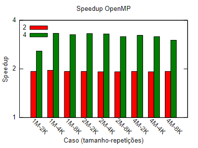

[Programação Paralela](https://github.com/lucasroges/elc139-2019a) > [T2](https://github.com/lucasroges/elc139-2019a/tree/master/trabalhos/t2) > OpenMP

Programação Paralela Multithread
--------------------------------

- Nome: Lucas Roges de Araujo
- Disciplina: Programação Paralela
--------------------------------

## Speedup para as execuções em OpenMP

|Tamanho base|Repetições|     2     |     4     | 4 (1 p/ 4)|
|:----------:|:--------:|:---------:|:---------:|:---------:|
|1M          |2000      |1,931807183|1,337790714|2,58435371 |
|1M          |4000      |1,969798061|1,688221743|3,325455916|
|1M          |8000      |1,932992672|1,689562456|3,265911845|
|2M          |2000      |1,936422716|1,711411752|3,314016594|
|2M          |4000      |1,923527808|1,712269719|3,293598419|
|2M          |8000      |1,924411125|1,648641646|3,172664325|
|4M          |2000      |1,927580988|1,678875041|3,236167612|
|4M          |4000      |1,925831502|1,64979693 |3,177230901|
|4M          |8000      |1,935898056|1,556531126|3,01328558 |

