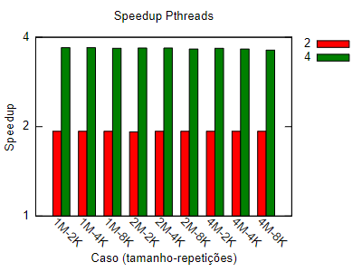

[Programação Paralela](https://github.com/lucasroges/elc139-2019a) > [T2](https://github.com/lucasroges/elc139-2019a/tree/master/trabalhos/t2) > Pthreads

Programação Paralela Multithread
--------------------------------

- Nome: Lucas Roges de Araujo
- Disciplina: Programação Paralela
--------------------------------

## Speedup para as execuções em Pthreads

|Tamanho base|Repetições|     2     |     4     | 4 (1 p/ 4)|
|:----------:|:--------:|:---------:|:---------:|:---------:|
|1M          |2000      |1,934125176|1,908456898|3,691194535|
|1M          |4000      |1,932195056|1,913873022|3,697975992|
|1M          |8000      |1,930878161|1,904701116|3,677745789|
|2M          |2000      |1,9279029  |1,909979284|3,682254601|
|2M          |4000      |1,931895474|1,907235576|3,684579777|
|2M          |8000      |1,932567882|1,89226876 |3,656937828|
|4M          |2000      |1,93201984 |1,902215441|3,675117972|
|4M          |4000      |1,931379363|1,892352566|3,654850693|
|4M          |8000      |1,932621245|1,87792521 |3,629318158|

