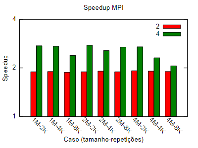

[Programação Paralela](https://github.com/lucasroges/elc139-2019a) > T5

# Primeiros passos com MPI

- Nome: Lucas Roges de Araujo
- Disciplina: Programação Paralela

## Parte 1
O programa solicitado está implementado em [parte1.cpp](parte1.cpp). Houve a utilização da operação de redução, assim como no [código do t2](https://github.com/lucasroges/elc139-2019a/blob/master/trabalhos/t2/openmp/openmp_dotprod.cpp), que no MPI é implementada através da função `MPI_Reduce`.

Speedup observado:

## Parte 2
O programa solicitado está implementado em [parte2.cpp](parte2.cpp). O programa escolhe um número aleatório no início da execução e realiza os passos descritos.

## Parte 3

- O programa [mpi_errado1.c](mpi_errado1.c) não funcionava como esperado por causa da utilização da variável `tag`. No caso, a variável precisa ter o mesmo valor para as chamadas `MPI_Send` e `MPI_Recv` **correspondentes**, o que não acontecia anteriormente.
- O programa [mpi_errado2.c](mpi_errado2.c) não funcionava como esperado porque não havia a chamada `MPI_Finalize()` antes do encerramento do programa.

## Referências

- [Message Passing Interface (MPI)](https://computing.llnl.gov/tutorials/mpi/)  
  Tutorial do Lawrence Livermore National Laboratory (LLNL) sobre MPI.

- [Open MPI Documentation](https://www.open-mpi.org/doc/)  
  Documentação da implementação Open MPI.

- [MPI Reduce and Allreduce](http://mpitutorial.com/tutorials/mpi-reduce-and-allreduce/)  
  Tutorial sobre a utilização da redução em MPI.