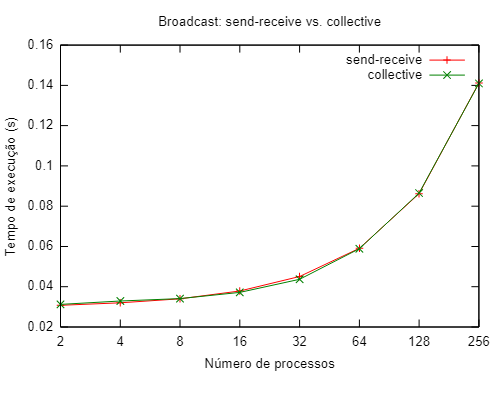
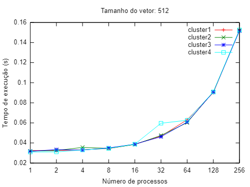
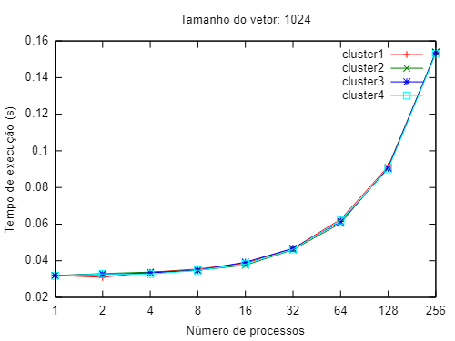
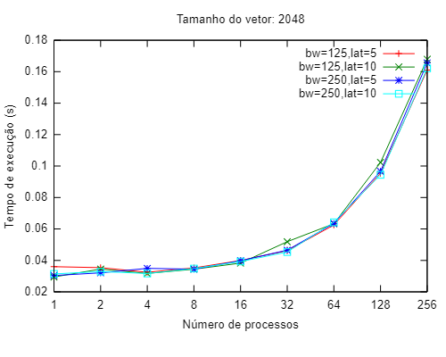

[Programação Paralela](https://github.com/lucasroges/elc139-2019a) > T7

# Avaliação de desempenho de programas MPI

- Nome: Lucas Roges de Araujo
- Disciplina: Programação Paralela

## Parte 1

Código para a utilização do *broadcast* nativo: [coll_bcast.c](coll_bcast.c).

Foram realizados testes de comparação entre as duas implementações variando o número de processos entre 2 e 256, utilizando as configurações de simulação disponobilizadas. O gráfico abaixo mostra como se comportou o tempo de execução de acordo com o aumento do número de processos.

Há um aumento do tempo de execução de acordo com o aumento do número de processos, o que ocorre porque a aplicação é basicamente comunicação. Dessa forma, não havendo processamento para se beneficiar do paralelismo, e sim apenas um aumento de mensagens a serem trocadas, o que ocasiona o aumento no tempo de execução.

As médias e os erros para as execuções da parte 1 podem ser vistos, detalhadamente, na [tabela](t7_p1.csv).

## Parte 2

Nessa seção, as modificações entre as execuções abrangeram a mudança de tamanho do vetor (tamanhos 512, 1024 e 2048), do número de processos (1 a 256), e dos parâmetros do cluster. 

Configuração dos clusters:

| Cluster | Bandwidth | Latency |
|:-------:|:---------:|:-------:|
|    1    |  125Mbps  |   5μs   |
|    2    |  125Mbps  |  1000μs |
|    3    |    5Bps   |   5μs   |
|    4    |    5Bps   |  1000μs |

Os gráficos abaixo ilustram o comportamento dos casos executados.

Gráfico para o vetor de tamanho 512:

Gráfico para o vetor de tamanho 1024:

Gráfico para o vetor de tamanho 2048:

As médias e os erros para as execuções da parte 2 podem ser vistos, detalhadamente e para todos os tamanhos, na [tabela](t7_p2.csv).

## Referências

- [Message Passing Interface (MPI)](https://computing.llnl.gov/tutorials/mpi/)  
  Tutorial do Lawrence Livermore National Laboratory (LLNL) sobre MPI.

- [Open MPI Documentation](https://www.open-mpi.org/doc/)  
  Documentação da implementação Open MPI.

- [MPI: A Message-Passing Interface Standart](https://www.mpi-forum.org/docs/mpi-3.1/mpi31-report.pdf)  
- [A Comprehensive MPI Tutorial Resource](http://mpitutorial.com/)  
- [SMPI CourseWare](https://simgrid.github.io/SMPI_CourseWare/)  
- [SMPI - Describing the virtual platform](http://simgrid.gforge.inria.fr/simgrid/3.20/doc/platform.html)
