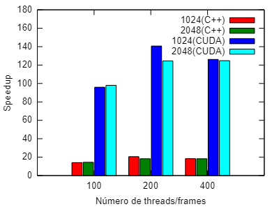

[Programação Paralela](https://github.com/lucasroges/elc139-2019a) > T8

# Geração de Imagem em Paralelo com CUDA

- Nome: Lucas Roges de Araujo
- Disciplina: Programação Paralela

## Slides

A apresentação de slides preparada encontra-se em [t8.pdf](t8.pdf).

## Parte 1

### 1. Implemente um programa nomeado `wavecuda1.cu`, em que cada frame seja computado em paralelo por uma thread diferente.

O código desenvolvido encontra-se em [wavecuda1.cu](wavecuda1.cu).

Esse código usa o número de *frames* como base para criação do número de *threads*. Dessa forma, seguindo a lógica do enunciado, cada *thread* executa um *frame* em particular e em paralelo. Isso limita o número de *frames* de acordo com o número de CUDA *cores* da GPU, mas ainda assim possibilita uma boa paralelização e otimização do tempo de execução.

Os outros dois códigos utilizados para critério comparativo foram [wave.cpp](wave/wave.cpp), que é o de execução sequencial em C++, e o [wavecuda1seq.cu](parte1/wavecuda1seq.cu), que é o de execução sequencial em CUDA.

### 2. Analise o desempenho do programa, começando pela medição dos tempos de execução sequencial e paralela para pelo menos 4 diferentes entradas do programa, sendo: a) 1024 100, b) 1024 200 e outras 2 entradas à sua escolha. Compare os tempos obtidos. Use nvprof para analisar o perfil de execução em GPU. Explique seus resultados.

#### Parâmetros de execução

O parâmetro de largura foi avaliado para os valores 1024 e 2048.

O parâmetro de quantidade de *frames* foi avaliado para os valores 100, 200 e 400.

Esses parâmetros foram executados para o código sequencial em C++, sequencial em CUDA e paralelo em CUDA.

#### Ambiente de execução

O ambiente de execução escolhido para testar a aplicação foi o *cluster* CDER. Alguns nós do *cluster* apresentam GPU, porém o único em que foi possível executar o script foi o `cder01`. Dessa forma foi criado o script [run.sh](parte1/run.sh) e executado através do comando:

```
sbatch --nodelist=cder01 run.sh
```

#### Resultados

Após a execução, os resultados foram agrupados no arquivo [resultadosp1.csv](parte1/resultadosp1.csv) e esses dados foram utilizado para visualizar o speedup do código implementado na figura abaixo:



## Parte 2

### 1. Implemente um programa nomeado `wavecuda2.cu`, que aproveite melhor o paralelismo da GPU.

O código desenvolvido encontra-se em [wavecuda2.cu](wavecuda2.cu).

O código desenvolvido paraleliza o laço das linhas das imagens e utiliza a técnica de múltiplos blocos para tirar melhor proveito da GPU.

Uma outra técnica observada nas referências, que sugeria a inicialização dos dados em um *kernel*, obteve êxito ao diminuir o tempo de execução do *kernel* de cálculos, porém o tempo gasto nesse *kernel* de inicialização não compensou a sua utilização.

### 2. Analise o desempenho do segundo programa.

#### Parâmetros de execução

O parâmetro de largura foi avaliado para os valores 1024 e 2048.

O parâmetro de quantidade de *frames* foi avaliado para os valores 100, 200 e 400.

Esses parâmetros são os mesmos escolhidos para a parte 1. Assim, na parte 2 foi executado apenas o código paralelo, que foi comparado com os resultados já obtidos na parte 1 para cálculos de *speedup*.

#### Ambiente de execução

O ambiente de execução é o mesmo da parte 1 e o script utilizado foi o [run.sh](parte2/run.sh).

#### Resultados

Após a execução, os resultados foram agrupados no arquivo [resultadosp1.csv](parte2/resultadosp2.csv) e esses dados foram utilizado para visualizar o speedup do código implementado na figura abaixo:


## Referências

- [CUDA C Programming Guide](https://docs.nvidia.com/cuda/cuda-c-programming-guide/)  
  Guia da NVIDIA sobre programação em CUDA.
  
- [Experiência com grids, blocks e threads em CUDA](https://colab.research.google.com/drive/1uSTM6C0p4n4aAuvFksplqFxa4NG87rMp)  
  Notebook no Google Colab com um programa que permite experimentos variando as dimensões de grids e blocos.

- [Unified Memory for CUDA Beginners](https://devblogs.nvidia.com/unified-memory-cuda-beginners/)

- [How to Submit a Job on CDER](https://help.rs.gsu.edu/display/PD/How+to+Submit+a+Job+on+CDER)  
  Guia para criar *scripts* para execução no CDER, utilizando o SLURM.

- [Boas Práticas para Experimentos Computacionais em Clusters de Alto Desempenho](https://github.com/viniciusvgp/tutorial-mc-erad-2019)  
  Tutorial auxiliar na geração *scripts* para fases de experimentação, coleta dos dados, análise e geração de gráficos.

- [GPGPU: How does running sequential code on a GPU compare to running sequential code on a CPU?](https://www.quora.com/GPGPU-How-does-running-sequential-code-on-a-GPU-compare-to-running-sequential-code-on-a-CPU)